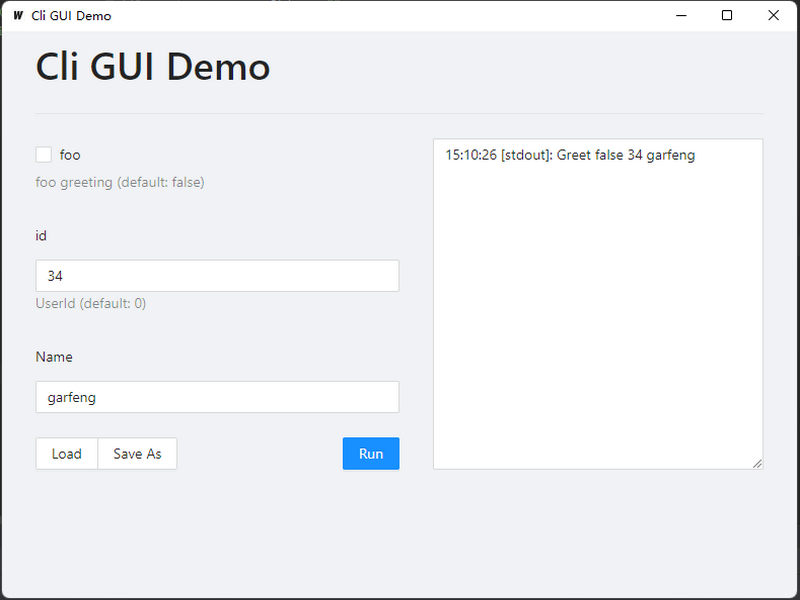

# Simple One page GUI for Go command line programs

【[简体中文](./doc/zh-cn.md)】

Is a tool to provide simple human interface for Go CMD APPS. 

- [x] Load struct from config.
- [x] Support [urfave/cli](https://github.com/urfave/cli).
- [ ] Config list combox.

| For cfg File Type                                            | For cli                                                      |
| ------------------------------------------------------------ | ------------------------------------------------------------ |
|  |  |

The UI is defined via `json-schema` :

``` json
{
    "$ref": "#/$defs/Args",
    "$defs": {
        "Args": {
            "properties": {
                "id": {
                    "type": "integer",
                    "title": "UID",
                    "description": "用户 ID"
                },
                "name": {
                    "type": "string",
                    "title": "用户名(Username)"
                }
            },
            "additionalProperties": false,
            "type": "object",
            "required": [
                "id",
                "name"
            ]
        }
    }
}
```

The `json-schema` is reflected from a struct :

``` go
type Args struct {
	Id   int    `json:"id" jsonschema:"title=UID,description=用户 ID(should be > 0),required"`
	Name string `json:"name" jsonschema:"title=用户名(Username),required"`
}
```

## Setup Steps

1. The GUI APP run core program with `-easygui-schema` flag at first, to get `json-schema` of it. 

2. With the schema, GUI APP could render an interface. 
3. When the `Run` button is clicked by user, The GUI APP will run the core program with args set in the interface.


## Simple examples

### 1. Load struct from config file

``` go
package main

import (
	"fmt"
	"github.com/garfeng/easyGUI/core/model"
	"github.com/garfeng/easyGUI/core/schema"
	"log"
)

type Args struct {
	Id   int    `json:"id" jsonschema:"title=UID,description=用户 ID(should be > 0),required"`
	Name string `json:"name" jsonschema:"title=用户名(Username),required"`
}

func main() {
	args := &Args{}
    
	// If get -easygui-schema flags, the program will auto print json-schema, and exit program with 0
	err := schema.Parse(args, model.AppOptions{
		AppTitle:         "Easy GUI Demo",
		Version:          "v0.0.1",
		ButtonSubmitText: "运行(Run)",
		ButtonSaveAsText: "另存为(Save As)",
		ButtonLoadText:   "加载配置(Load)",
	})

	if err != nil {
		log.Fatal(err)
		return
	}

	fmt.Println("Add user", args.Id, args.Name)
}

```

``` shell
go build -o easyGUI-core.exe
```

``` shell
./easyGUI-core.exe --help
# Usage of ./easyGUI-core.exe:
#  -easygui-cfgPath string
#        config file
#  -easygui-schema
#        schema flag
```

``` shell
./easyGUI-core.exe -easygui-schema
# {
#  "code": 0,
#  "schema": "{\"$ref\":\"#/$defs/Args\",\"$defs\":{\"Args\":{\"properties\":{\"id\":{\"type\":\"integer\",\"title\":\"UID\",\"description\":\"用户 ID(should be \\u003e 0)\"},\"name\":{\"type\":\"string\",\"title\":\"用户名(Username)\"}},\"additionalProperties\":false,\"type\":\"object\",\"required\":[\"id\",\"name\"]}}}",
#  "appOptions": {
#    "appTitle": "Easy GUI Demo",
#    "version": "v0.0.1",
#    "submitButtonText": "运行(Run)",
#    "buttonSaveAsText": "另存为(Save As)",
#    "buttonLoadText": "加载配置(Load)"
#  },
#  "error": ""
# }
```


### 2. Cli 

``` go
package main

import (
	"fmt"
	"github.com/garfeng/easyGUI/core/model"
	"github.com/garfeng/easyGUI/core/schema"
	"github.com/urfave/cli/v2"
	"log"
	"os"
)

func main() {
	foo := false
	id := 0
	name := ""

	app := &cli.App{
		Flags: []cli.Flag{
			&cli.BoolFlag{
				Name:        "foo",
				Usage:       "foo greeting",
				Destination: &foo,
			},
			&cli.IntFlag{
				Name:        "id",
				Usage:       "UserId",
				Destination: &id,
			},
			&cli.StringFlag{
				Name:        "Name",
				Destination: &name,
			},
		},
		Action: func(context *cli.Context) error {
			fmt.Println("Greet", foo, id, name)
			return nil
		},
	}
	
	//  If get -easygui-schema flags, the program will auto print json-schema, and exit program with 0
	err := schema.ParseCli(app, model.AppOptions{
		AppTitle:         "Cli GUI Demo",
		Version:          "v0.0.1",
		ButtonSubmitText: "Run",
		ButtonSaveAsText: "Save As",
		ButtonLoadText:   "Load",
	})
	if err != nil {
		log.Fatal(err)
	}

	if err := app.Run(os.Args); err != nil {
		log.Fatal(err)
	}
}

```

``` shell
go build -o cli-demo-core.exe
```

``` shell
./cli-demo-core.exe --help
# NAME:
#    cli-demo-core.exe - A new cli application

# USAGE:
#    cli-demo-core.exe [global options] command [command options] [arguments...]

# COMMANDS:
#   help, h  Shows a list of commands or help for one command

# GLOBAL OPTIONS:
#   --easygui-schema  print schema (default: false)
#   --foo             foo greeting (default: false)
#   --id value        UserId (default: 0)
#   --Name value
#   --help, -h        show help (default: false)
```

``` shell
./cli-demo-core.exe -easygui-schema
# {
#  "code": 0,
#  "schema": "{\"properties\":{\"foo\":{\"type\":\"boolean\",\"title\":\"foo\",\"description\":\"foo greeting (default: false)\"},\"id\":{\"type\":\"integer\",\"title\":\"id\",\"description\":\"UserId (default: 0)\"},\"Name\":{\"type\":\"string\",\"title\":\"Name\"}},\"type\":\"object\"}",
#  "appOptions": {
#    "appTitle": "Cli GUI Demo",
#    "version": "v0.0.1",
#    "submitButtonText": "Run",
#    "buttonSaveAsText": "Save As",
#    "buttonLoadText": "Load"
#  },
#  "error": "",
#  "type": "cli"
# }
```


