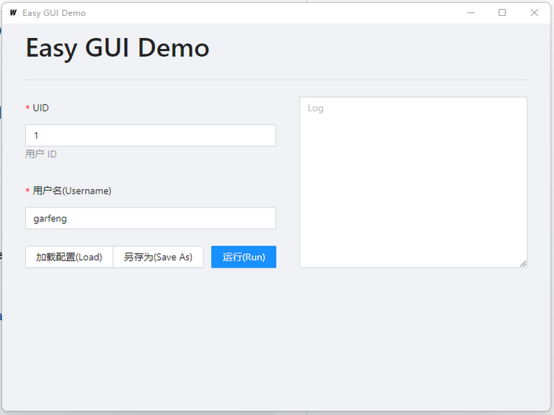

# Simple One page GUI for Go APPs

【[简体中文](./doc/zh-cn.md)】

Is a tool to provide simple human interface for Go Cmd APPS. 



The UI is defined by `json-schema` :

``` json
{
    "$ref": "#/$defs/Args",
    "$defs": {
        "Args": {
            "properties": {
                "id": {
                    "type": "integer",
                    "title": "UID",
                    "description": "用户 ID"
                },
                "name": {
                    "type": "string",
                    "title": "用户名(Username)"
                }
            },
            "additionalProperties": false,
            "type": "object",
            "required": [
                "id",
                "name"
            ]
        }
    }
}
```

The `json-schema` is refrected from a struct :

``` go
type Args struct {
    Id   int    `json:"id" jsonschema:"title=UID,description=用户 ID(should be > 0),required"`
	Name string `json:"name" jsonschema:"title=用户名(Username),required"`
}
```


A simple example: 

``` go
package main

import (
	"fmt"
	"github.com/garfeng/easyGUI/core/model"
	"github.com/garfeng/easyGUI/core/schema"
	"log"
)

type Args struct {
	Id   int    `json:"id" jsonschema:"title=UID,description=用户 ID(should be > 0),required"`
	Name string `json:"name" jsonschema:"title=用户名(Username),required"`
}

func main() {
	args := &Args{}
    
    // If get -schema flags, the program will auto print json-schema
	err := schema.Parse(args, model.AppOptions{
		AppTitle:         "Easy GUI Demo",
		Version:          "v0.0.1",
		ButtonSubmitText: "运行(Run)",
		ButtonSaveAsText: "另存为(Save As)",
		ButtonLoadText:   "加载配置(Load)",
	})

	if err != nil {
		log.Fatal(err)
		return
	}

	fmt.Println("Add user", args.Id, args.Name)
}

```

``` shell
go build -o easyGUI-core.exe
```

``` shell
./easyGUI-core.exe --help
# Usage of ./easyGUI-core.exe:
#  -c string
#        config file
#  -schema
#        schema flag
```

``` shell
./easyGUI-core.exe --schema
#{
#  "code": 0,
#  "schema": "{\"$ref\":\"#/$defs/Args\",\"$defs\":{\"Args\":{\"properties\":{\"id\":{\"type\":\"integer\",\"title\":\"UID\",\"description\":\"用户 ID(should be \\u003e 0)\"},\"name\":{\"type\":\"string\",\"title\":\"用户名(Username)\"}},\"additionalProperties\":false,\"type\":\"object\",\"required\":[\"id\",\"name\"]}}}",
#  "appOptions": {
#    "appTitle": "Easy GUI Demo",
#    "version": "v0.0.1",
#    "submitButtonText": "运行(Run)",
#    "buttonSaveAsText": "另存为(Save As)",
#    "buttonLoadText": "加载配置(Load)"
#  },
#  "error": ""
#}
```

With the schema, the GUI App could rendering human interface.
